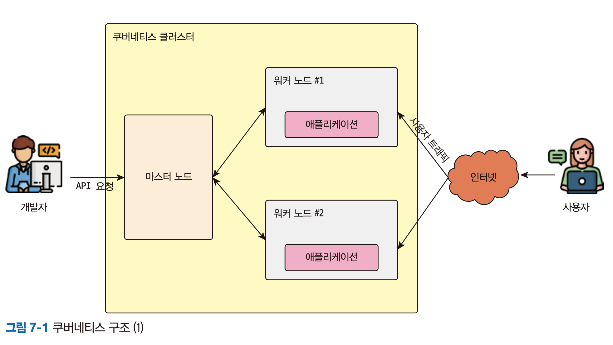
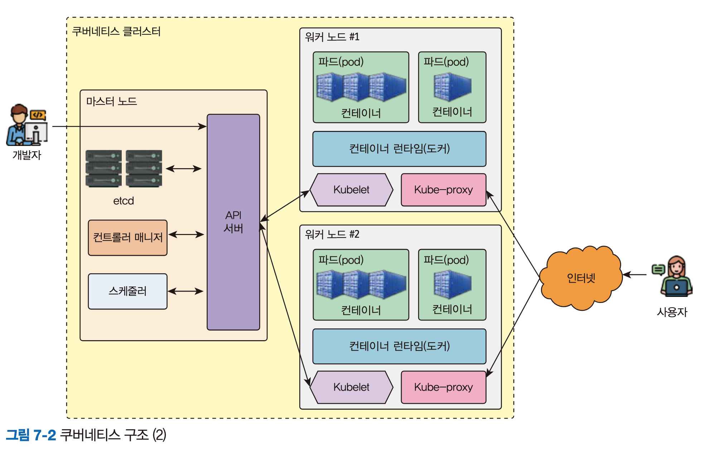
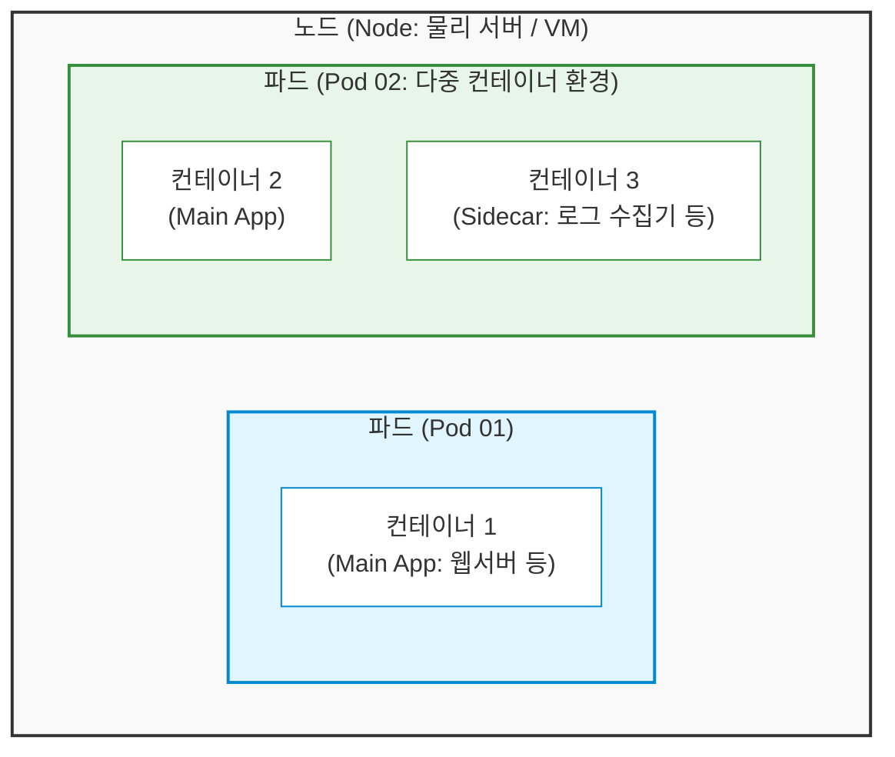

# 쿠버네티스 클러스터

# CNI(Container Network Interface)
 - Flannel, calico

# 7.2.3 컨트롤 플레인
 - 쿠버네티스 클러스트 전반의 작업을 관리하는 역할
## API 서버
  - 쿠버네티스 작업은 kubectl 명령어를 통해 마스터 노드의 kube-apiserver 에게 API요청을 보낸다. 
  - API서버는 쿠버네티스 컨트롤 플레인에서의 프런트엔드 역할을 한다.
## etcd
  - 데이터 저장하는 key-value 저장소
  
## Pod
 - 
## 스케줄러(kube-scheduler)
 - 새롭게 생성되는 pod를 어느 노드에 실행시킬지 정하는 역할 

## 컨트롤러 매니저
 - 쿠버네티스 리소스를 관리하고 제어하는 역할
 - 마스터 노드에서 실행되며 클러스터 상태를 모니터링한다.
 - 종류
   - Deployment Controller
   - Service Controller
   - ReplicaSet Controller

# 7.2.3 노드

## 노드 (Node) = "일하는 물리적인 서버 (화물선)"
노드는 쿠버네티스 클러스터를 구성하는 실제 컴퓨터(서버)입니다. CPU나 메모리 같은 물리적인 자원을 제공하며, 마스터 노드의 지휘를 받아 실제로 일을 하는 장소입니다.

종류: 진짜 물리적인 서버일 수도 있고, 클라우드(AWS, GCP 등)의 가상 머신(VM)일 수도 있습니다.

비유: 여러 개의 화물(컨테이너)을 싣고 바다를 항해하는 거대한 화물선 한 대라고 생각하시면 됩니다. 화물선이 커야(서버 성능이 좋아야) 더 많은 짐을 실을 수 있습니다.

## 파드 (Pod) = "쿠버네티스의 가장 작은 배포 단위 (컨테이너 묶음 상자)"
파드는 쿠버네티스에서 컨테이너를 하나 또는 여러 개 묶어서 관리하는 가장 작은 단위입니다. 쿠버네티스는 컨테이너(예: 도커 컨테이너)를 하나씩 따로 배포하지 않고, 항상 '파드'라는 보자기(상자)에 싸서 배포합니다.

특징: 하나의 파드 안에 있는 컨테이너들은 IP 주소와 저장 공간을 공유하며 서로 아주 밀접하게 통신합니다. (대부분은 1개의 파드에 1개의 컨테이너를 넣어서 씁니다.)

비유: 화물선에 싣는 컨테이너 상자 하나입니다. 이 상자 안에는 서비스에 필요한 웹 서버 프로그램이나 앱이 들어가서 돌아갑니다.

 - 도커에서는 컨테이너가 단독으로 실행되지만, 쿠버네티스에서는 컨테이너가 단독으로 실행되지 않고 Pod 내에서 실행된다.
 - Pod는 컨테이너를 실행하기 위한 오브젝트로 1개 이상의 컨테이너를 담을 수 있다.
 - 즉, Pod는 컨테이너를 그룹화한 것이라 생각하면 된다.
 - 쿠버네티스의 최소 실행 단위
 - 하나의 Pod에 속하는 컨테이너들은 모두 같은 노드에서 실행된다.
 - 컨테이너처럼 일시적인 존재로 실행할 때마다 ip주소를 배정받으르모 **pod의 ip주소는 실행할 때마다 변경**된다.

### 📊 한눈에 비교하기

| 구분 | 파드 (Pod) | 노드 (Node) |
| --- | --- | --- |
| **개념** | 애플리케이션(컨테이너)의 실행 단위 | 애플리케이션이 실행되는 물리/가상 서버 |
| **역할** | 내 안에서 실제 프로그램(코드)이 돌아감 | 파드가 안정적으로 돌 수 있게 하드웨어 자원 제공 |
| **크기 관계** | **노드 안에 여러 개의 파드**가 들어감 | **파드를 품고 있는** 더 큰 개념 |
| **비유** | 화물 상자 (내용물: 웹서버, DB 등) | 화물선 (컴퓨터 그 자체) |

- kubectl run hello-world 명령어로 만든 것이 바로 파드(Pod)이고, 이 **파드가 실제로 생성되어 자리를 잡고 실행되는 컴퓨터(myserver01)가 바로 노드(Node)** 가 됩니다.
- 즉, "노드(myserver01)라는 서버 위에서 파드(hello-world)가 실행된다"라고 이해하시면 완벽합니다.

---
### Node, Pod, Container 관계

구조를 큰 상자부터 작은 상자 순서로 정리하면 다음과 같습니다.

노드 (Node) > 파드 (Pod) > 컨테이너 (Container)

* **노드 (가장 큰 상자):** 실제 컴퓨터나 가상 서버입니다. 이 물리적인 공간 안에 여러 개의 파드가 들어갑니다.
* **파드 (중간 상자):** 노드 안에서 실행되는 쿠버네티스의 기본 배포 단위입니다. 이 파드 상자 안에 컨테이너가 들어갑니다.
* **컨테이너 (가장 작은 상자):** 파드 안에서 실제로 돌아가는 애플리케이션 프로세스(예: Nginx 웹서버, Spring Boot 앱 등)입니다.

보통은 **하나의 파드 안에 하나의 컨테이너**를 넣어서 실행하는 경우가 대부분(`1 Pod = 1 Container`)이지만, 필요에 따라 하나의 파드 안에 본 메인 컨테이너를 도와주는 보조 컨테이너를 함께 묶어서 넣을 수도 있습니다.

구조를 헷갈리지 않고 정확하게 짚으셨으니, 이제 매니페스트(YAML) 파일로 파드를 마음껏 띄우셔도 좋습니다!

---

## Kubelet
 - 파드 내부의 컨테이너 실행을 담당
 - 파드의 상태를 모니터링하고, 파드의 상태에 이상이 있다면 해당 파드를 다시 배포한다.
## Kube-Proxy
 - 노드에서 네트워크 역할을 수행
 - 노드에 존재하는 파드들이 쿠버네티스 내부/외부와 네트워크 통신을 가능한게 한다.

## 컨테이너 런타임
 - 컨테이너 생명주기를 담당

---
# 7.2.4 워크로드
 - 쿠버네티스에서 실행되는 애플리케이션을 의미한다.

## ReplicaSet
 - 복제 관리, 클라이언트가 요구하는 복제본 개수만큼 파드를 복제하고 모니터링하고 관리한다.
## Deployment
 - 애플리케이션의 배포와 스케일링을 관리하는 배치

## StatefulSet
 - Pod 사이에서 순서와 고유성이 보장되어야 하는 경우에 사용한다.

## DaemonSet
 - 쿠버네티스를 구성하는 모든 노드가 파드의 복사본을 실행하도록 한다.
 - 주로 로깅, 모니터링, 스토리지 등과 같은 시스템 수준의 서비스르 실행하는데 사용한다.

## Job, Cronjob
 - 작업(Task)이 정상적으로 완료되고 종료되는 것을 담당한다.
 - Pod 가 정상적으로 종료되지 않는다면 재실행시킨다. 
 - Cronjob은 리눅스의 Crontab과 비슷한 역할

---
# 7.2.5 네트워크
## 서비스
## 인그레스(Ingress)

---
# 7.2.6 스토리지
 - 쿠버네티스 스토리지는 Pod의 상태와 상관없이 파일을 보관할 수 있다.

# 8.1.7 containerd

# 8.1.8 swap 메모리 비활성화
