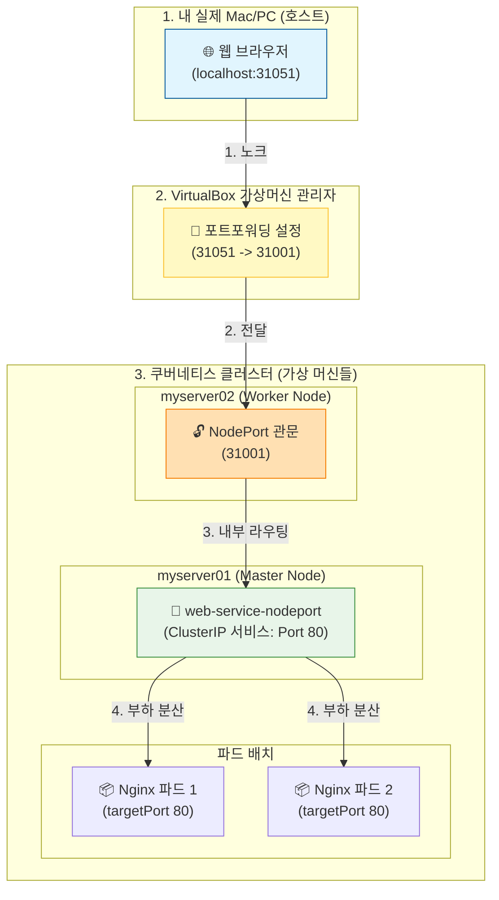
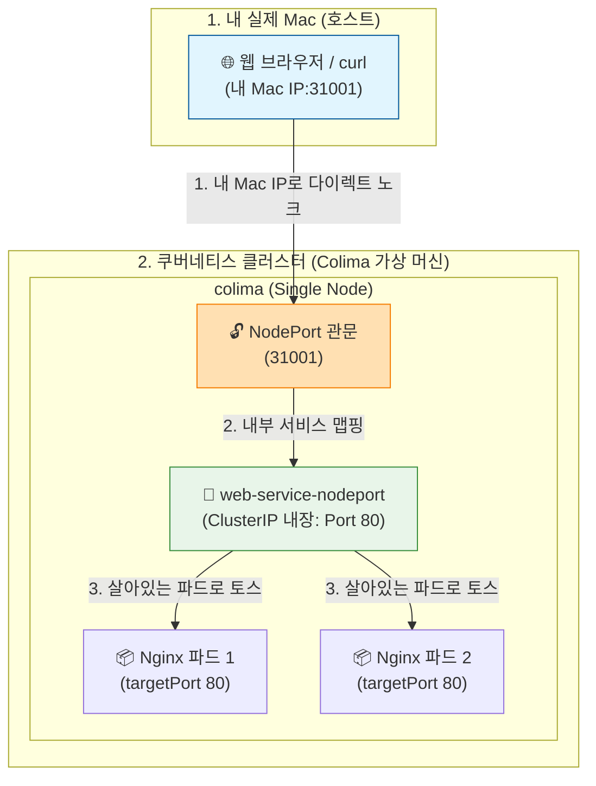

## 9.3.3 NodePort 서비스 요약

### 1. 기본 개념

* **외부 접근 제공:** NodePort는 클러스터 내부에서만 접근 가능했던 ClusterIP와 달리, **각 노드(Node)의 특정 포트를 개방하여 외부에서 파드(Pod)에 접근할 수 있도록 포트를 노출하는 유형**입니다.
* **상위 집합(Superset):** NodePort 서비스는 내부적으로 ClusterIP의 기능을 기능을 모두 포함하고 있습니다. 즉, NodePort를 생성하면 클러스터 내부 통신을 위한 ClusterIP도 자동으로 함께 생성됩니다.


### 2. 동작 방식 및 특징

* **포트 범위:** NAT(네트워크 주소 변환)를 사용하여 클러스터 내 모든 노드의 지정된 포트 범위(**30000 ~ 32767**) 중 하나를 외부에 개방합니다. (※ 책 본문의 오타 수정: `30000 ~ 23767`로 표기되어 있으나, 표준 쿠버네티스 NodePort 범위는 **30000 ~ 32767**입니다.)
* **접근 주소:** 클러스터 외부에서는 `<NodeIP>:<NodePort>` 형식으로 접속하여 노드의 IP와 지정된 포트를 통해 내부 파드로 트래픽을 보낼 수 있습니다.
* **라우팅 흐름:** 외부 사용자가 임의의 노드 IP와 포트로 접속하면, NodePort 서비스가 이 요청을 받아 뒷단에 있는 디플로이먼트 및 레플리카셋의 실제 파드(컨테이너)들로 트래픽을 안전하게 전달합니다.

---

**실습**


```
apiVersion: v1                            # ➋ apiVersion을 설정합니다.
kind: Service                             # ➌ 오브젝트 타입은 Service라고 설정합니다.
metadata:                                 # ➍ 메타 데이터를 작성합니다.
  name: web-service-nodeport              # ➎ 서비스 이름을 정합니다.
spec:                                     # ➏ spec을 통해 오브젝트의 상태를 정해줍니다.
  selector:                               # ➐ 해당 서비스가 연동하게 될 앱을 정합니다.
    app.kubernetes.io/name: web-deploy    # ➑ 앞서 만든 디플로이먼트 파일인 deploy-test01에서 생성한 web-deploy 앱과 연동할 것이므로 web-deploy라고 정합니다.
  type: NodePort                          # ➒ 서비스 타입을 NodePort라고 정합니다.
  ports:                                  # ➓ 해당 서비스를 사용하기 위한 포트 정보를 입력합니다.
  - protocol: TCP                         # ⓫ 프로토콜은 TCP를 사용합니다.
    nodePort: 31001                       # ⓬ 외부에서 노드의 IP를 통해 접근할 포트 번호(31001)를 지정합니다.
    port: 80                              # ⓭ 서비스 자체의 포트 번호를 80으로 지정합니다.
    targetPort: 80                        # ⓮ 파드(컨테이너) 내부에서 실행 중인 앱의 실제 포트 번호(80)로 매핑합니다.
```

---
## `nodePort`, `port`, `targetPort` 배교
- 이 세 가지는 트래픽이 통과하는 3단계 관문(포트)이라고 생각하면 이해하기 아주 쉽습니다.
  
  
## 외부 사용자가 내 컨테이너까지 들어오는 순서

### 🚪 1단계: `nodePort: 31001` (외부 대문 포트)

* **역할:** 클러스터 외부(사용자)에서 노드의 IP를 통해 처음으로 치고 들어오는 대문 포트입니다.
* **비유:** 회사 건물 로비에 있는 '방문객 전용 출입구 번호'입니다. 외부 사람은 무조건 이 번호(31001)를 통해서만 건물 안으로 발을 디딜 수 있습니다.

### 🏢 2단계: `port: 80` (쿠버네티스 서비스 포트)

* **역할:** 클러스터 내부(Service)에서 사용하는 서비스 자체의 포트입니다.
* **비유:** 건물 로비를 통과한 방문객이 찾아가는 '인포메이션 데스크(또는 부서 대표 번호)'입니다. 클러스터 내부의 다른 파드들이 이 서비스를 찾을 때도 이 80번 포트를 바라보고 호출하게 됩니다.

### 📦 3단계: `targetPort: 80` (실제 컨테이너 포트)

* **역할:** 맨 마지막에 트래픽이 최종 목적지인 **파드(컨테이너) 내부의 애플리케이션**으로 도달할 때의 포트입니다.
* **비유:** 인포메이션 데스크에서 안내해 준 담당 직원의 '자리 내선 번호'입니다. 여기서는 Nginx 웹 서버가 실제로 켜져서 대기하고 있는 방 번호(80)가 됩니다.

---

### 🔄 한눈에 보는 트래픽 흐름

외부 사용자가 요청을 보내면 다음과 같은 지도를 따라 이동합니다.

```
[외부 사용자] 
     │
     ▼ (노드 IP:31001로 접속)
 ➊ nodePort (31001) : 외부 대문을 열고 진입
     │
     ▼ (서비스가 요청을 받음)
 ➋ port (80)       : 서비스 중심점(부서 대표 번호)에서 트래픽을 접수
     │
     ▼ (실제 파드로 토스)
 ➌ targetPort (80) : 파드 내부의 웹 서버(Nginx)로 최종 배달 완료!

```

요약하자면, 외부 대문(`nodePort`)을 열고 들어와서, 서비스 데스크(`port`)를 거쳐, 실제 앱의 방 번호(`targetPort`)로 찾아간다고 기억하시면 됩니다!


---
## 1. 책의 환경 (VirtualBox 다중 노드)

책에서는 내 PC(호스트)와 가상 머신들 사이에 **VirtualBox라는 중간 관리자**가 있어서 포트를 두 번 토스해야 했습니다. 또한 노드가 여러 대(`myserver01~03`) 존재했습니다.



---

## 2. 사용자님의 성공 환경 (Colima 단일 노드)

반면, 사용자님이 성공하신 **Colima 환경**은 중간 관리자(VirtualBox) 없이 **내 Mac의 네트워크 인터페이스(내 Mac IP)와 가상 머신의 내부가 다이렉트로 연결**되어 있습니다. 노드도 `colima` 하나뿐입니다.



---

## 💡 개념 한 줄 정리 (내가 성공한 이유)

1. **`nodePort: 31001`은 가상 머신의 대문이다:** Colima라는 가상 서버에 `31001`이라는 구멍을 뚫은 것입니다.
2. **Colima는 내 Mac IP와 대문을 동기화한다:** Colima는 내 Mac의 실제 IP로 들어오는 `31001` 요청을 가상 머신 내부의 `31001`로 바로 이어주는 고속도로를 자동으로 깔아줍니다.
3. **아까 `192.168.5.1`이 실패한 이유:** 이 IP는 가상 머신 내부에서만 쓰는 '내부용 대문 주소'라 내 Mac(외부)에서는 주소를 찾을 수 없었던 것입니다. 대신 내 Mac의 진짜 IP를 사용하니 대문이 활짝 열린 것입니다.

구조가 조금 더 명확해지셨나요? 네트워크 통로가 어떻게 연결되는지 이 그림을 기억하시면 앞으로의 서비스 실습도 훨씬 수월해지실 겁니다!