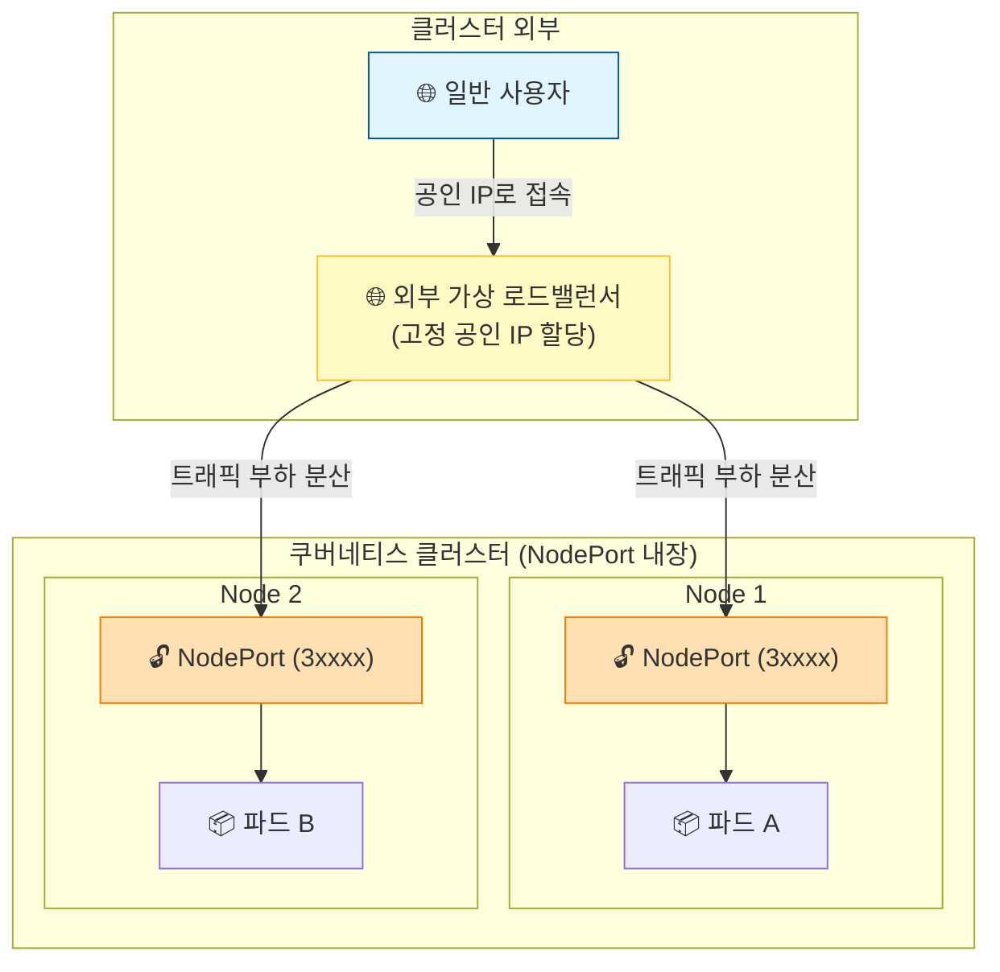

# 9.3.4 **LoadBalancer(로드밸런서)** 서비스

- NodePort의 기능을 한 단계 더 확장한 최상위 집합(Superset)입니다.
- 실제 운영 환경(클라우드)에서 외부 사용자의 트래픽을 서비스할 때 가장 많이 사용하는 방식입니다.
  
---

## 1. LoadBalancer 서비스의 핵심 개념

* **외부 전용 공인 IP 제공:** NodePort는 각 노드의 IP와 포트 번호를 직접 치고 들어와야 했지만, LoadBalancer를 사용하면 쿠버네티스가 외부에서 접속할 수 있는 단 하나의 고정된 공인 IP(External IP)를 서비스에 통째로 할당해 줍니다.
* **NodePort의 상위 집합:** LoadBalancer 유형으로 서비스를 생성하면, 내부적으로 **[ClusterIP ➡️ NodePort ➡️ LoadBalancer]** 구조가 계층적으로 자동 생성됩니다.

---

## 2. 왜 NodePort가 있는데 LoadBalancer를 쓸까요?

NodePort만 사용하면 외부 사용자가 특정 노드의 IP(`myserver02` 등)를 알아야 하고, 만약 그 노드가 다운되면 접속이 끊기는 문제가 발생합니다.

LoadBalancer는 클라우드 공급사(AWS, GCP, Azure 등)가 제공하는 외부 로드밸런서 시스템과 쿠버네티스를 연동하여 이 문제를 해결합니다.

1. **단일 창구:** 사용자는 노드 주소를 알 필요 없이, 오직 로드밸런서가 제공하는 **단 하나의 공인 IP**만 바라보고 접속합니다.
2. **트래픽 분산:** 외부 로드밸런서가 알아서 클러스터에 있는 여러 노드들의 NodePort로 트래픽을 공평하게 나누어 보내줍니다.
3. **안정성 (HA):** 하나의 노드가 죽더라도 로드밸런서가 살아있는 다른 노드로 트래픽을 돌려주기 때문에 서비스가 중단되지 않습니다.

---

## 💡 로컬(Colima) 환경에서의 참고 사항

실제 AWS나 GCP 같은 클라우드 환경에서는 LoadBalancer 서비스를 만들면 외부 가상 장비가 붙으면서 `EXTERNAL-IP`가 자동으로 할당됩니다.

하지만 내 PC(Colima/로컬 환경)에서 생성하면 외부 클라우드 시스템이 없기 때문에 기본적으로 `EXTERNAL-IP`가 `<pending>`(대기 중) 상태로 멈춰있게 됩니다. 로컬 환경에서 이를 테스트하려면 별도의 툴(예: MetalLB)을 설치하거나, 환경에 내장된 로드밸런서 기능을 활용해야 합니다.

다음 페이지에서 LoadBalancer의 YAML 설정이나 실습 내용이 이어진다면, 마저 올려주세요. 연이어 정리해 드릴게요!