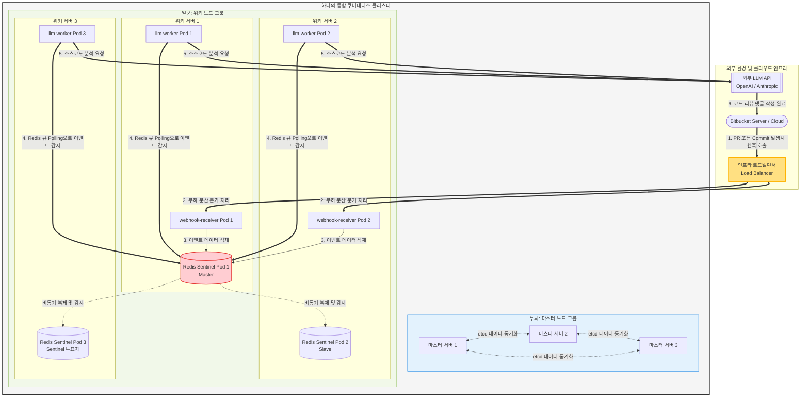

```mermaid
graph TD
    %% 외부 레이어
    subgraph External [외부 환경 및 클라우드 인프라]
        BB([Bitbucket Server / Cloud])
        ILB[인프라 로드밸런서 <br> Load Balancer]
        AI_API[[외부 LLM API <br> OpenAI / Anthropic]]
    end

    %% 쿠버네티스 단일 클러스터 영역
    subgraph K8S_HA_Cluster [하나의 통합 쿠버네티스 클러스터]
        
        %% 컨트롤 플레인 그룹
        subgraph Control_Plane [두뇌: 마스터 노드 그룹]
            M1[마스터 서버 1]
            M2[마스터 서버 2]
            M3[마스터 서버 3]
            
            M1 <.->|etcd 데이터 동기화| M2
            M2 <.->|etcd 데이터 동기화| M3
            M3 <.->|etcd 데이터 동기화| M1
        end

        %% 데이터 플레인 그룹
        subgraph Worker_Plane [일꾼: 워커 노드 그룹]
            
            subgraph Node1 [워커 서버 1]
                WR1[webhook-receiver Pod 1]
                RS1[(Redis Sentinel Pod 1 <br> Master)]
                WK1[llm-worker Pod 1]
            end

            subgraph Node2 [워커 서버 2]
                WR2[webhook-receiver Pod 2]
                RS2[(Redis Sentinel Pod 2 <br> Slave)]
                WK2[llm-worker Pod 2]
            end

            subgraph Node3 [워커 서버 3]
                RS3[(Redis Sentinel Pod 3 <br> Sentinel 투표자)]
                WK3[llm-worker Pod 3]
            end

        end
    end

    %% 데이터 흐름 (Data Flow)
    BB ==>|1. PR 또는 Commit 발생시 웹훅 호출| ILB
    ILB ==>|2. 부하 분산 분기 처리| WR1 & WR2
    
    WR1 & WR2 -->|3. 이벤트 데이터 적재| RS1
    RS1 -.->|비동기 복제 및 감시| RS2 & RS3
    
    WK1 & WK2 & WK3 ==>|4. Redis 큐 Polling으로 이벤트 감지| RS1
    
    WK1 & WK2 & WK3 ==>|5. 소스코드 분석 요청| AI_API
    AI_API ==>|6. 코드 리뷰 댓글 작성 완료| BB

    %% 스타일 가이드
    style K8S_HA_Cluster fill:#f5f5f5,stroke:#333,stroke-width:2px
    style Control_Plane fill:#e3f2fd,stroke:#1e88e5,stroke-width:1px
    style Worker_Plane fill:#f1f8e9,stroke:#7cb342,stroke-width:1px
    style ILB fill:#ffe082,stroke:#ffb300,stroke-width:2px
    style RS1 fill:#ffcdd2,stroke:#e53935,stroke-width:2px

```