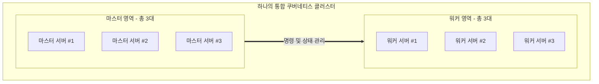

```mermaid
graph TD
    subgraph K8S_Cluster [하나의 통합 쿠버네티스 클러스터]
        subgraph Control_Plane_Group [마스터 영역 - 총 3대]
            M1[마스터 서버 #1]
            M2[마스터 서버 #2]
            M3[마스터 서버 #3]
        end

        subgraph Worker_Plane_Group [워커 영역 - 총 3대]
            W1[워커 서버 #1]
            W2[워커 서버 #2]
            W3[워커 서버 #3]
        end
    end

    %% 연결 관계
    Control_Plane_Group ====>|명령 및 상태 관리| Worker_Plane_Group
```
