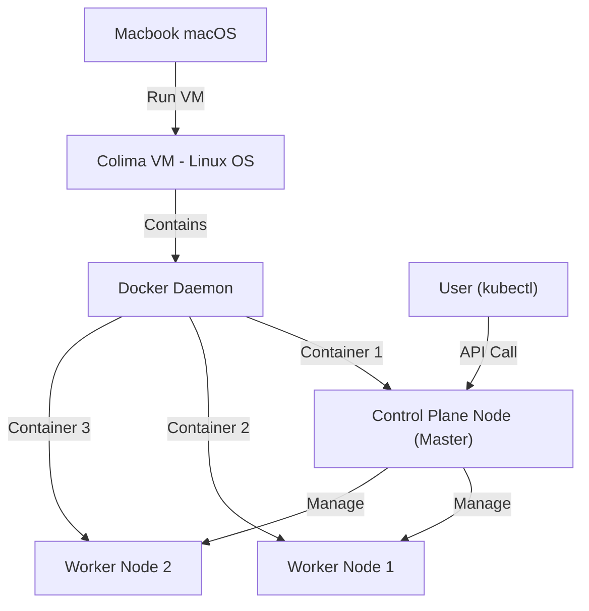

# 맥북 로컬 쿠버네티스 다중 노드 실습 가이드

본 문서는 맥북(macOS) 환경에서 **Colima**와 **Kind**를 사용하여 실제 운영 환경과 유사한 다중 노드(Multi-node) 쿠버네티스 클러스터를 구축하고 관리하는 방법을 정리한 가이드입니다.

---

## 1. 아키텍처 및 개념 이해

맥북 1대 내에서 다수의 서버 노드를 흉내 내기 위해 아래와 같은 가상 구조를 사용합니다.



* **Colima**: macOS에서 가벼운 Linux 가상 머신(VM) 및 Docker 컨테이너 실행 환경을 제공합니다.
* **Kind (Kubernetes in Docker)**: Docker 컨테이너들을 가상의 쿠버네티스 서버 노드로 조립 및 묶어주는 도구입니다.
* **Kubernetes (kubectl)**: 다중 노드로 구성된 클러스터 전체를 조율하는 컨테이너 오케스트레이션 도구입니다.

---

## 2. 실습 준비 및 도구 설치

macOS 패키지 관리자인 Homebrew를 사용하여 필요한 CLI 도구를 설치합니다.

```bash
# 1. 가상 가상머신 및 Docker 관련 도구 설치
brew install colima docker

# 2. 쿠버네티스 및 클러스터 관리 도구 설치
brew install kind kubernetes-cli
```

---

## 3. 로컬 클러스터 구축 단계

### 단계 1: 가상 머신(Colima) 기동
쿠버네티스를 구동하기 위해 충분한 CPU와 메모리를 할당하여 Colima를 실행합니다.
```bash
colima start --cpu 2 --memory 4 --disk 30
```

### 단계 2: 다중 노드 설정 파일 작성
`control-plane` 노드 1개와 `worker` 노드 2개를 정의하는 설정 파일(`kind-multi-node.yaml`)을 작성합니다.

```yaml
kind: Cluster
apiVersion: kind.x-k8s.io/v1alpha4
name: local-prod-test
nodes:
- role: control-plane
- role: worker
- role: worker
```

### 단계 3: 클러스터 생성
설정 파일을 사용하여 다중 노드 클러스터를 기동합니다.
```bash
kind create cluster --config kind-multi-node.yaml
```

### 단계 4: 구성 노드 확인
클러스터가 정상 기동되었는지 노드 목록을 조회합니다.
```bash
kubectl get nodes -o wide
```

---

## 4. 실습 및 배포 테스트

다중 노드 환경에서 Pod 스케줄링이 고르게 일어나는지 확인하기 위한 테스트 명령어입니다.

```bash
# Nginx 웹 서버를 3개 복제본으로 배포
kubectl create deployment nginx --image=nginx --replicas=3

# 배포된 Pod의 상세 분산 배치 현황 확인
kubectl get pods -o wide
```

---

## 5. 실습 종료 및 리소스 정리

실습을 마치고 컴퓨터의 CPU, 메모리 자원을 환수하기 위한 안전한 종료 순서입니다.

```bash
# 1. 실습용 Nginx Deployment 삭제
kubectl delete deployment nginx

# 2. Kind 쿠버네티스 클러스터 파괴 (가상 노드 삭제)
kind delete cluster --name local-prod-test

# 3. Colima VM 중지 (Docker 엔진 중지 및 메모리 반환)
colima stop
```
