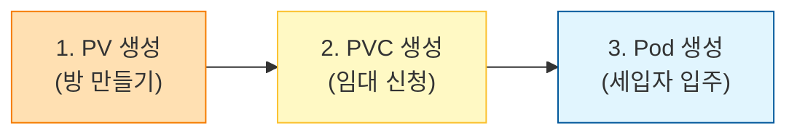

## 🔍 화살표가 의미하는 3가지 핵심 연결 고리

### 1. 1번 화살표: 파드 ➡️ PVC (`claimName: pvc-01`)

* **위치:** 왼쪽 `Pod` 파일의 `volumes.persistentVolumeClaim.claimName`에서 가운데 `PVC` 파일의 `metadata.name`으로 이어지는 선입니다.
* **의미:** 파드가 생성될 때 "나는 `pvc-01`이라는 이름의 신청서(계약서)를 기반으로 영구 저장소를 확보하겠다"라고 명시하는 단계입니다. 이 연결을 통해 파드는 외부 저장소 자원을 내 몸에 마운트할 수 있게 됩니다.

### 2. 2번 화살표: PVC ➡️ PV 매칭 (`storageClassName: pv-test-01`)

* **위치:** 가운데 `PVC`와 오른쪽 `PV` 파일의 `storageClassName: pv-test-01`을 서로 묶어주는 선입니다.
* **의미:** 쿠버네티스에게 "이름이 `pv-test-01`인 스토리지 클래스(분류) 중에서 방을 매칭해줘"라고 요청하는 것입니다. 이 클래스 이름이 서로 일치해야만 쿠버네티스가 두 객체를 연결(Bound)해 줍니다.
* **용량 체크:** 또한, PVC가 요청한 용량(`storage: 30Mi`)이 PV가 가진 전체 용량(`storage: 100Mi`)보다 작거나 같으므로, 계약 조건이 충족되어 성공적으로 매칭됩니다.

### 3. 3번 화살표: PV ➡️ 실제 NFS 저장소 연결 (`nfs`)

* **위치:** 오른쪽 `PV` 파일 내부의 `nfs` 설정 부분입니다.
* **의미:** 이 PV(방)가 가리키는 **진짜 물리적인 하드웨어 저장소의 주소**를 나타냅니다. 여기서는 `10.0.2.6` 주소를 가진 실제 NFS 서버의 `/tmp/k8s-pv`라는 디렉터리를 영구 저장 공간의 종착지로 삼고 있습니다.

---

## 💡 한 줄 요약

결국 이 그림은 개발자가 파드에 "pvc-01 써라"라고 적으면 ➡️ 쿠버네티스가 **동일한 스토리지 클래스를 가진 pv-01을 매칭**하고 ➡️ 최종적으로 **NFS 서버(`10.0.2.6`)의 실제 폴더로 데이터가 영구 저장되는 흐름**을 증명하는 지도입니다.

쿠버네티스에서 영구 스토리지를 사용하기 위해 Pod, PVC, PV를 생성하고 배포할 때는 **안정적인 연결(Binding)을 위해 역순으로 생성하는 것이 올바른 절차**입니다.

실제 집을 짓고 세입자가 들어오는 과정에 비유하여 단계별 순서와 절차를 쉽게 설명해 드릴게요.

---

## 🛠️ 생성 및 배포 순서: PV ➡️ PVC ➡️ Pod

### 1단계: PersistentVolume (PV) 생성 ── "방 만들기"

가장 먼저 인프라 관리자가 실제 데이터를 저장할 하드웨어 공간(NFS, AWS EBS 등)을 쿠버네티스에 등록해야 합니다. 가상 세계에 실제 존재하는 방(저장소)을 준비하는 단계입니다.

* **절차:** 1. 실제 스토리지 서버(예: NFS 서버 등)에 디렉터리를 만들고 권한을 설정합니다.
2. PV 매니페스트(`pv.yaml`)를 작성합니다. 이때 용량(`capacity`), 접근 모드(`accessModes`), 그리고 `storageClassName`을 반드시 지정합니다.
3. `kubectl apply -f pv.yaml` 명령어로 클러스터에 PV를 생성합니다.

### 2단계: PersistentVolumeClaim (PVC) 생성 ── "임대 신청서 제출"

방이 준비되었으니, 개발자가 내 애플리케이션이 사용할 저장 공간을 요청하는 신청서를 제출합니다.

* **절차:**
1. PVC 매니페스트(`pvc.yaml`)를 작성합니다. 필요한 용량(`requests.storage`)과 PV와 동일한 `storageClassName`을 적어줍니다.
2. `kubectl apply -f pvc.yaml` 명령어로 PVC를 생성합니다.
3. **쿠버네티스의 매칭:** PVC가 생성되는 순간, 쿠버네티스는 클러스터에 남아있는 PV 중 `storageClassName`과 용량 조건이 맞는 PV를 찾아 둘을 묶어줍니다. (`Bound` 상태가 됨)

### 3단계: Pod 생성 ── "세입자 입주"

이제 저장 공간 계약이 완료되었으므로, 실제 컨테이너 파드를 띄우면서 방금 체결한 계약서(PVC)를 파드 몸에 연결합니다.

* **절차:**
1. 파드 매니페스트(`pod.yaml`)를 작성합니다.
2. `spec.volumes` 항목에 영구 볼륨을 쓸 것이라고 명시하고, 방금 만든 PVC의 이름(`claimName`)을 적어줍니다.
3. 컨테이너 설정(`volumeMounts`) 안에 파드 내부의 어떤 경로(`/mount01` 등)로 이 저장소를 연결할지 마운트 경로를 지정합니다.
4. `kubectl apply -f pod.yaml` 명령어로 파드를 생성합니다. 파드가 켜지면서 외부 저장소와 연결이 최종 완료됩니다.

---

## ⚠️ 반대로 생성하면 어떻게 되나요? (Pod나 PVC를 먼저 만들면?)

쿠버네티스는 똑똑하기 때문에 순서가 뒤바뀌어도 시스템이 터지지는 않지만, 대기 상태(Pending)에 걸리게 됩니다.

* **만약 Pod를 가장 먼저 생성하면?**
* 파드가 "나 `pvc-01`이라는 계약서가 필요해!" 하고 찾는데 아직 PVC가 없으므로 파드는 켜지지 못하고 `Pending` 상태로 멈춥니다.

* **이어서 PVC를 생성하면?**
* PVC가 생성되었지만 이번에는 "나한테 맞는 PV(실제 방)가 없네?" 하고 PVC마저 `Pending` 상태로 멈춥니다.

* **마지막으로 PV를 생성하면?**
* PV가 생성되는 순간 도미노처럼 PVC가 PV와 묶이고(`Bound`), 이어서 파드가 PVC를 인식하면서 정상적으로 실행(`Running`)됩니다.

**💡 결론:**
개념적으로 꼬이지 않고 한 번에 매끄럽게 배포하기 위해서는 항상 하드웨어 자원인 **PV를 먼저 깔아두고, PVC로 신청한 뒤, Pod가 가져다 쓰도록** 순서를 잡는 것이 가장 깔끔합니다!